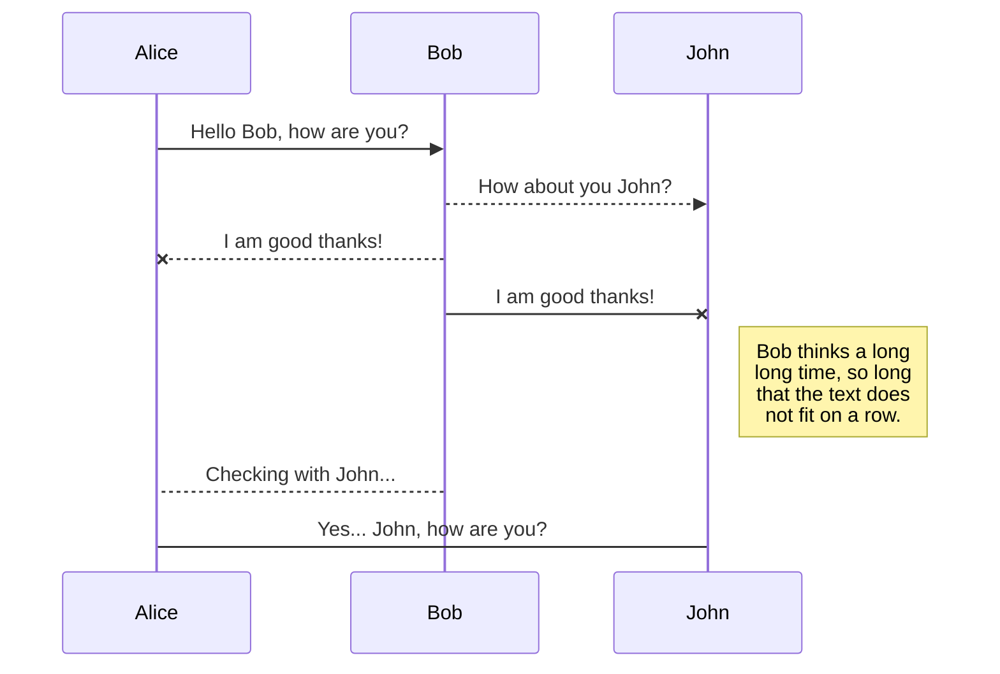
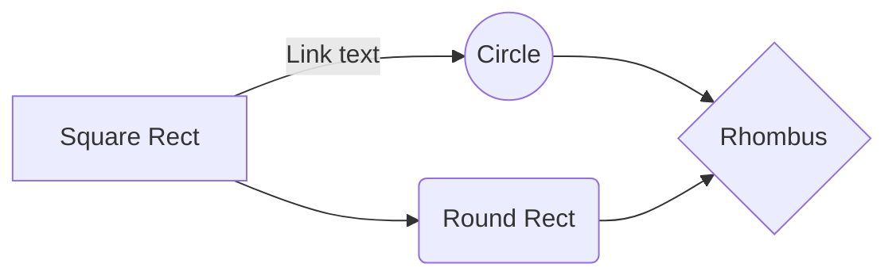

# EGM_Devops
---
**GitLab** tutorials 
<br/> 
*and data Lorem ipsum dolor, sit amet consectetur adipisicing elit.*
<br/>
> Quisquam nemo omnis neque, alias accusamus ad blanditiis,
- sequi odio voluptatem vitae,
- - - a  ipsum?
- Quasi suscipit in enim vero quaerat qui provident?
---

## Git Installing
`Aliquam rem consectetur natus quisquam corrupti,`
<br/>

---

## Git Installing
```sh
- npx create-react-app frontend
- npm i
- cd frontend
- npx start-expo
```
[GitHub Link] (https://github.com/hamitmizrak/EGM_Devops)
<br/>
[GitLab Link] ()
---




And this will produce a flow chart:


